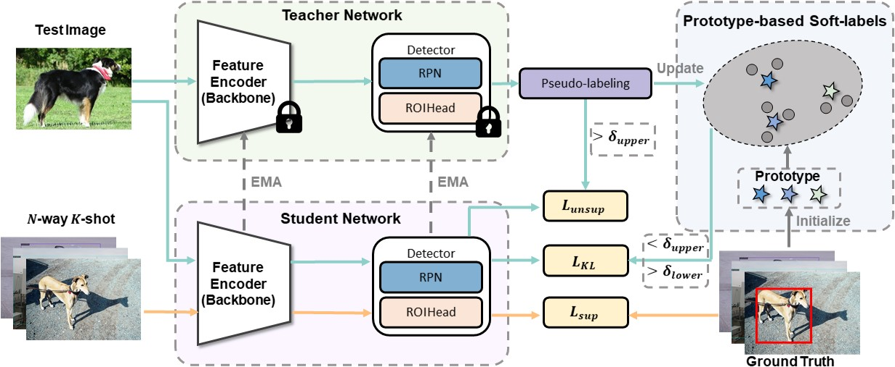

# PS-TTL
This is the implementation of the paper “PS-TTL: Prototype-based Soft-labels and Test-Time Learning for Few-shot Object Detection” (MM 2024, [arxiv](https://arxiv.org/pdf/2408.05674))

## Overview
The overview of the proposed Prototype-based Soft-labels and Test-Time Learning (PS-TTL) framework for FSOD. Both the student and teacher networks are first initialized by the few-shot detector and then fine-tuned on test data. The teacher network takes test data as input to generate pseudo-labels, while the student model is trained using these pseudo-labels after post-processing with N-way K-shot data as supervision signals and updates the teacher network through EMA. A Prototype-based Soft-labels (PS) strategy is adopted to maintain class prototypes and compute the feature similarity between low-confidence pseudo-labels and class prototypes to replace them with soft-labels.

<div align="center"></div>

## Requirements
* Linux with Python == 3.7
* [PyTorch](https://pytorch.org/get-started/locally/) == 1.6.0 & Torchvision == 0.7.0
* CUDA == 10.1
* Detectron2 == 0.4


## Prepare Data and Weights
* Data preparation
  - Download the VOC and COCO datasets from their respective official websites. Download vocsplit and cocosplit from [DeFRCN](https://github.com/er-muyue/DeFRCN). Organize these files as follows:
    
    ```angular2html
      ...
      configs
      datasets
        | -- coco (trainval2014/*.jpg, val2014/*.jpg, annotations/*.json)
        | -- cocosplit
        | -- VOC2007
        | -- VOC2012
        | -- vocsplit
      ...
    ```
  
* Weights Preparation
  - We use the model weights that have been fine-tuned on novel data as the initialization for our model. Organize these `.pth` files as follows:
    ```angular2html
      ...
      configs
      model_weights
        | -- convert_ts.py
        | -- defrcn_voc_split1
           | -- voc_split1_1shot.pth
           | -- voc_split1_2shot.pth
           | -- voc_split1_3shot.pth
           ...
        | -- defrcn_voc_split2
        | -- defrcn_voc_split3
        | -- defrcn_coco
      ...
    ```
  - Then, use the `convert_ts.py` to convert the weights.
    ```angular2html
    python model_weights/convert_ts.py                      
                model_weights/defrcn_voc_split1/voc_split1_1shot.pth 
                model_weights/defrcn_voc_split1/voc_split1_1shot_ts.pth
    ```

## Training and Evaluation

We have prepared the weights (e.g., `voc_split1_1shot_ts.pth`), and next, we will utilize the test data and the 1-shot data from VOC split 1 for test-time learning.
* To perform test-time learning, , including the evaluation, run the following command:
  ```angular2html
  python train_net.py --num-gpus 1 --config configs/voc_ttl/defrcn_split1_1shot.yaml 
              MODEL.WEIGHTS model_weights/defrcn_voc_split1/voc_split1_1shot_ts.pth
              OUTPUT_DIR output/defrcn_voc_split1_1shot
  ```
  

## Acknowledgement
Our project is developed based on [DeFRCN](https://github.com/er-muyue/DeFRCN) and [unbiased-teacher](https://github.com/facebookresearch/unbiased-teacher). Please check them for more details.

## Citation

You can cite our paper with such bibtex:
```
@inproceedings{gao2024ps,
  title={PS-TTL: Prototype-based Soft-labels and Test-Time Learning for Few-shot Object Detection},
  author={Gao, Yingjie and Zhang, Yanan and Huang, Ziyue and Liu, Nanqing and Huang, Di},
  booktitle={Proceedings of the 32nd ACM International Conference on Multimedia},
  pages={8691--8700},
  year={2024}
}
```
